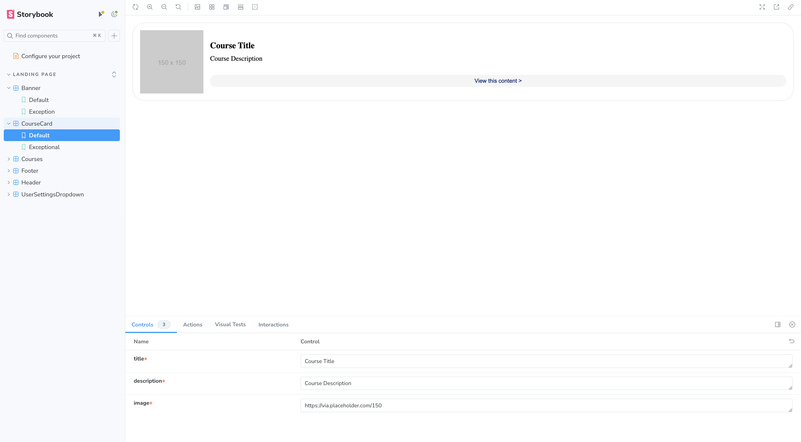
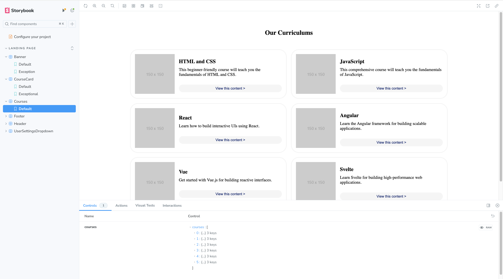

# FRONTEND SCHOOL

## Live Version Deployed
https://frontend-school.vercel.app/

## Introduction

This project is a [Next.js](https://nextjs.org/) application built to explore new frameworks and technologies. Previously, I have extensively used [Vite](https://vitejs.dev/) for building React applications, but this time I chose Next.js to gain new experiences. This project I believe meets the criteria of React 18, using Git and SCSS. 

## Technologies Used

- **Framework**: [Next.js](https://nextjs.org/) 
- **Styling**: SCSS
- **Component Development**: [Storybook](https://storybook.js.org/)
- **State Management**: [React Query](https://react-query.tanstack.com/)
- **Utilities**: React Dev Tools
- **Backend**: [Supabase](https://supabase.io/)
- **AI Assistance**: [GitHub Copilot](https://github.com/features/copilot) (for writing comments and helping with CSS when needed)

## Motivation

### Framework Choice
- **Next.js**: To explore new frameworks beyond Vite for building React applications.

### Styling
- **Material UI**: Previously used in multiple React projects for college assignments and thats why I chose to use just SCSS to learn this new style.
- **SCSS**: Chosen to gain experience with SCSS and due to the project specifications. This project involved thorough research and learning of SCSS, and I look forward to using it more extensively in future projects.

### Component Development
- **Storybook**: Components were developed in isolation using Storybook and integrated once they were complete. This approach ensured modularity and ease of testing.

### Utilities
- **React Dev Tools & React Query**: Included to follow good practices for growing applications. React Query was particularly useful for managing server state.

## Design
- Followed high-fidelity designs as closely as possible, using specified colors and images.

## Backend

### Supabase
- **Storage**: Utilized Supabase's bucket storage for images. The image URLs were stored in the courses table as well as the provided keys.
- **Client Setup**: Keys were stored in `env.local` and a client was created to interact with Supabase.
- **React Query Integration**: React Query was used to cache results from Supabase, minimizing redundant calls. This was a bit OTT but if an app was to be scaled in the future it is a nice to have.
- **Experience**: Previous experience with Supabase during my Masters dissertation highlighted its flexibility with RPCs, buckets, and real-time capabilities.
